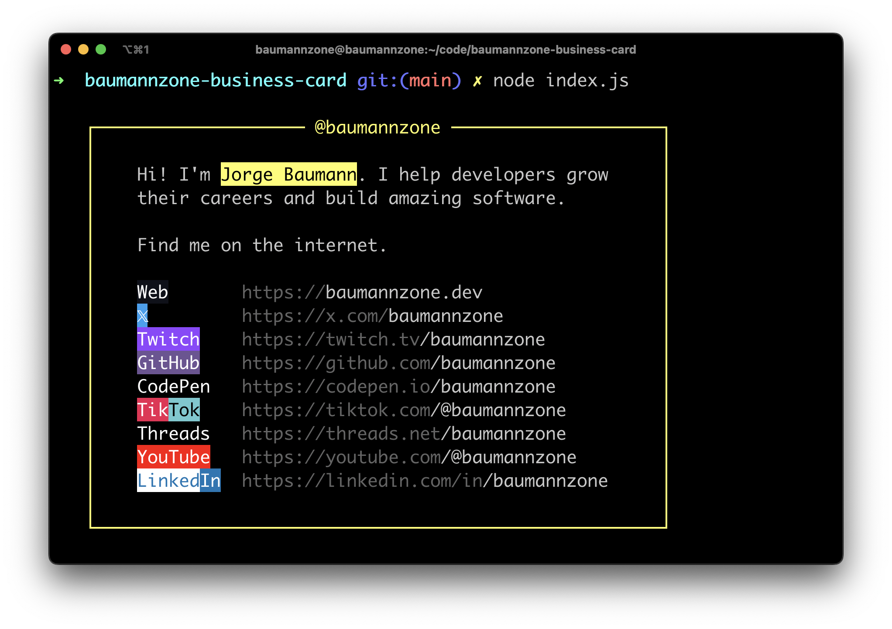

# Developer Business Card

A beautiful CLI business card to showcase your online presence.



## Usage

By default, it will display the original author's (@baumannzone) social media handles:
```bash
npx developer-card
```

You can use your own handle for all services:
```bash
npx developer-card yourusername     # Will display as "@yourusername"
```

You can also customize your display name (use quotes for names with spaces):
```bash
npx developer-card yourusername "Your Full Name"    # Will display as "Your Full Name"
```

### Custom Service Handles

You can override specific services by using the format `service=handle`. Multiple services can share the same handle by separating them with commas:

```bash
npx developer-card defaulthandle "Your Name" instagram,twitter=customhandle github=otherhandle
```

#### Web Domain Customization
The web service supports two types of overrides:

1. Domain-only override (keeps your handle):
```bash
npx developer-card myhandle web=.com     # Results in myhandle.com
npx developer-card myhandle web=.io      # Results in myhandle.io
```

2. Full URL override:
```bash
npx developer-card myhandle web=glrodasz.io  # Results in glrodasz.io
```

**Note:** By default, Threads will use the same handle as Instagram unless explicitly overridden:
```bash
# Both Instagram and Threads will use 'myinsta'
npx developer-card mydefault instagram=myinsta

# Override Threads separately
npx developer-card mydefault instagram=myinsta threads=different
```

## Requirements
- Node.js with npm installed

## Available Services
- Web (.dev domain by default)
- X (Twitter)
- Twitch
- GitHub
- CodePen
- TikTok
- Threads
- YouTube
- LinkedIn
